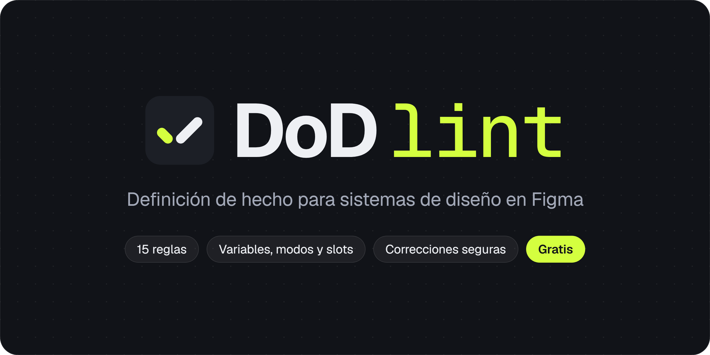
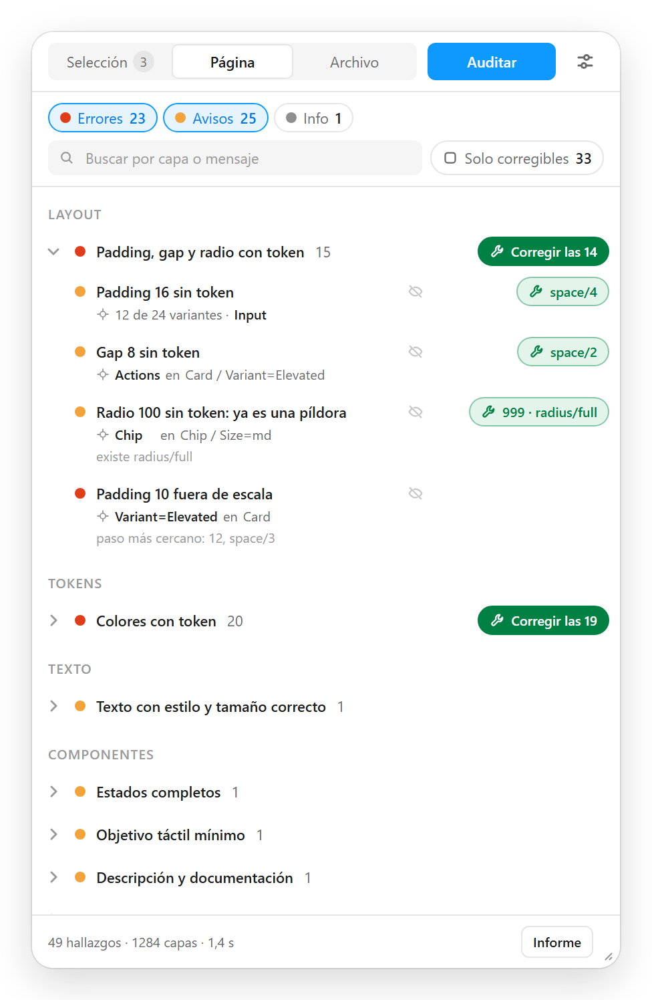
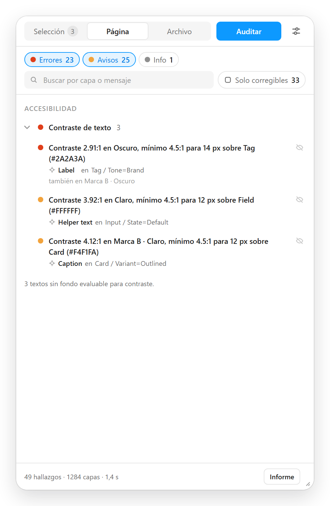
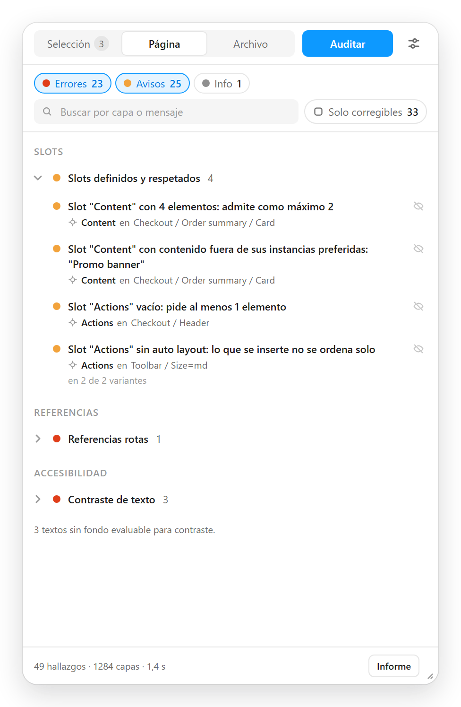
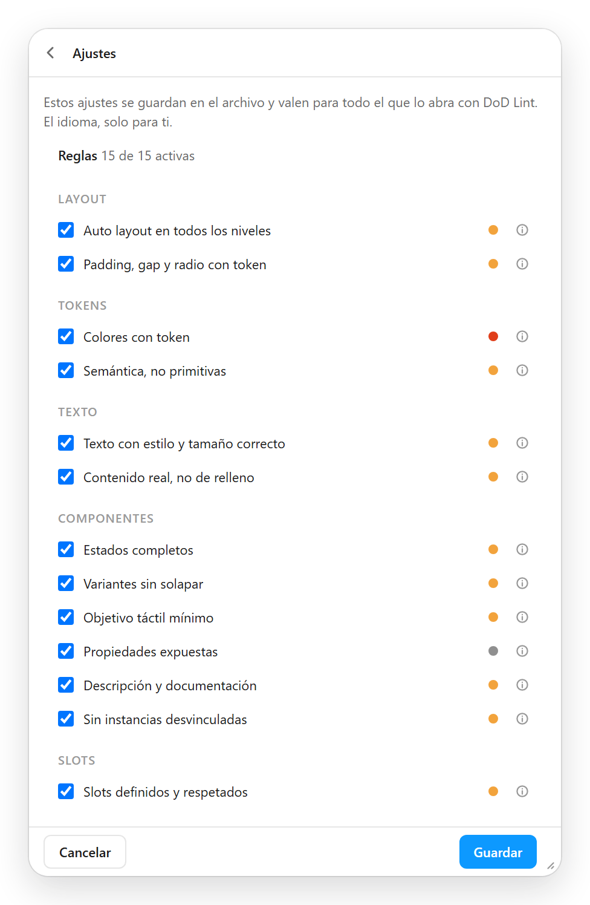

<p align="center">
  
</p>

<p align="center">
  
  
  
  
  
</p>

<p align="center">
  <a href="README.md">English</a> · <b>Español</b>
</p>

Plugin de Figma que comprueba si una página, una selección o un archivo entero cumple una **Definición de hecho** de sistema de diseño: quince comprobaciones que van desde el auto layout y los tokens hasta los estados, el objetivo táctil, los slots, las instancias desvinculadas, la documentación y el contraste. Devuelve una lista navegable de hallazgos, un informe en Markdown y correcciones seguras para los casos en los que ya existe la variable correcta.

Es gratis, todo: auditar la selección, la página o el archivo entero, aplicar correcciones y exportar el informe. La interfaz y los hallazgos están en inglés y en español. En automático sigue el idioma del sistema, y se puede fijar en los ajustes.

<p align="center">
  <a href="#las-quince-reglas">Reglas</a> ·
  <a href="#correcciones-seguras">Correcciones</a> ·
  <a href="#cómo-se-usa">Cómo se usa</a> ·
  <a href="#privacidad">Privacidad</a> ·
  <a href="#ayuda">Ayuda</a> ·
  <a href="#desarrollo">Desarrollo</a>
</p>

## Así se ve

<table>
  <tr>
    <td align="center" valign="top" width="50%">
      <br>
      <sub><b>Hallazgos y correcciones.</b> Cada hallazgo, en su capa. La llave inglesa dice qué variable enlaza.</sub>
    </td>
    <td align="center" valign="top" width="50%">
      <br>
      <sub><b>Contraste en cada modo.</b> Dentro de un componente, en todos los modos de los que dependen sus colores.</sub>
    </td>
  </tr>
  <tr>
    <td align="center" valign="top">
      <br>
      <sub><b>Slots.</b> Límites, contenido fuera de las instancias preferidas y slots vacíos.</sub>
    </td>
    <td align="center" valign="top">
      <br>
      <sub><b>La Definición de hecho.</b> Las reglas y sus umbrales se guardan en el archivo.</sub>
    </td>
  </tr>
</table>

<sub>Capturas del panel con los datos de ejemplo de <code>docs/listing/source/mock.js</code>.</sub>

## Las quince reglas

| | Regla | Qué marca | Severidad | Corrige |
|---|---|---|:---:|:---:|
| **Layout** | Auto layout en todos los niveles<br>`auto-layout` | Frames y grupos con dos o más hijos sin auto layout | 🟠 | |
| | Padding, gap y radio con token<br>`spacing` | Padding, gap y radio sin variable; fuera de escala si el archivo tiene variables de espaciado o de radio. Si no se usa ninguna de un tipo, una nota en vez de un aviso por capa | 🔴 🟠 | ✓ |
| **Tokens** | Colores con token<br>`color` | Rellenos y trazos con color literal; no el marco de los sets de variantes, que ninguna instancia hereda | 🔴 | ✓ |
| | Semántica, no primitivas<br>`primitive` | Color enlazado a una primitiva en vez de a la capa semántica; no las muestras de una paleta, que llevan su nombre | 🟠 | ✓ |
| **Texto** | Texto con estilo y tamaño correcto<br>`text` | Texto sin estilo ni variables tipográficas; cajas fijas sin truncado | 🟠 ⚪ | |
| | Contenido real, no de relleno<br>`placeholder` | Texto de relleno dentro de componentes (información si es el valor por defecto de una propiedad de texto); lorem ipsum en cualquier sitio | 🟠 ⚪ | |
| **Componentes** | Estados completos<br>`states` | Sets con el eje de estado incompleto (a campos y controles de selección no se les pide Pressed); interactivos sin eje de estado | 🟠 ⚪ | |
| | Variantes sin solapar<br>`stacked` | Variantes de un set que se solapan en el lienzo: apiladas si una cubre la mitad o más de otra | 🟠 ⚪ | |
| | Objetivo táctil mínimo<br>`touch` | Controles cuyo lado más corto no llega al mínimo (24 px por defecto, el de WCAG 2.2 AA) | 🟠 | |
| | Propiedades expuestas<br>`props` | Componentes sin propiedad de texto, instance swap o booleano (el contenido de los slots no cuenta) | ⚪ | |
| | Descripción y documentación<br>`description` | Descripción vacía o corta; sin enlace de documentación, si se pide en ajustes. Los iconos no cuentan | 🟠 ⚪ | |
| | Sin instancias desvinculadas<br>`detached` | Frames desvinculados de su componente, con su nombre si es local; información si el componente se eliminó | 🟠 ⚪ | |
| **Slots** | Slots definidos y respetados<br>`slots` | En componentes: propiedad de slot sin capa, slot sin auto layout, contenido por defecto fuera de límites, "solo instancias preferidas" con la lista vacía, slot sin descripción. En instancias: slot por debajo del mínimo, por encima del máximo o con contenido no preferido | 🔴 🟠 ⚪ | |
| **Referencias** | Referencias rotas<br>`broken` | Variables, estilos o componentes principales que ya no resuelven, y modos puestos en capas o páginas para colecciones que ya no existen | 🔴 🟠 | ✓ |
| **Accesibilidad** | Contraste de texto<br>`contrast` | Contraste WCAG del texto contra su primer fondo sólido, en su modo y, dentro de los componentes, en cada modo de las colecciones de las que dependen sus colores (salvo los que fija un ancestro); también el de los textos de las instancias, donde están colocadas | 🔴 🟠 | |

<sub>🔴 error · 🟠 aviso · ⚪ información · ✓ con corrección segura. Los detalles de cada regla están en <a href="docs/desarrollo.md#las-reglas-en-detalle">las notas de desarrollo</a>.</sub>

## Correcciones seguras

- **Nunca inventan valores.** Solo enlazan una variable que ya existe y vale exactamente lo mismo, ajustan al paso de escala más cercano si se activa en ajustes (viene desactivado, porque cambia la medida), o quitan una referencia que ya no resuelve.
- **Comprueban antes de tocar.** Antes de aplicar cada una comprueban que la capa y la variable siguen como en la auditoría; si algo ha cambiado, la omiten.
- **Por regla o por fila.** «Corregir las N», en la cabecera de cada regla, aplica las de esa regla que deja ver el filtro. El botón de cada fila, con la llave inglesa y la variable que enlaza («space/sm», «12 · space/3»), aplica solo las de esa fila.
- **Un paso de deshacer por tanda.** Cada tanda queda en un único paso de deshacer, y un aviso abajo del panel ofrece «Deshacer» durante unos segundos. Con el foco en el plugin, Ctrl+Z (Cmd+Z en Mac) también la deshace.

## Cómo se usa

1. Abre un archivo de diseño de Figma y ejecuta **Plugins → DoD Lint**. Hasta que esté en Community, se carga desde el código (ver [Desarrollo](#desarrollo)).
2. Elige qué auditar: **Selección**, **Página** o **Archivo** (todas las páginas).
3. Pulsa **Auditar**. Las reglas que se pasan están en **Ajustes** (el icono de los deslizadores) y se guardan en el archivo, así que quien lo abra con DoD Lint audita con la misma Definición de hecho.
4. Pulsa un hallazgo para seleccionar su capa en el lienzo.
5. Corrige con «Corregir las N» o con la llave inglesa de una fila, o ignora el hallazgo con el ojo tachado.
6. **Informe** te da la auditoría en Markdown, para copiarla o descargarla.

## Privacidad

DoD Lint no recoge, guarda ni envía datos personales ni contenido de los archivos. No tiene acceso a la red (lo declara su manifiesto), ni analítica, ni servicios de terceros. Lee las variables de las bibliotecas activadas en el archivo a través de Figma, para proponerlas en las correcciones.

Solo guarda tu idioma, en el almacenamiento local de plugins de Figma, y los ajustes y los hallazgos que ignores, en los datos de plugin del propio archivo. La [política de privacidad completa](docs/support.md#privacy-policy) está en inglés.

## Ayuda

La [página de ayuda](docs/support.md), en inglés, explica cada regla, los ajustes y las preguntas más frecuentes. Para un fallo o una duda, [abre un issue](https://github.com/jm-fuster/dod-lint/issues): cuenta qué esperabas, qué pasó y qué regla salió. No adjuntes archivos confidenciales.

## Desarrollo

```bash
npm install
npm run build    # dist/code.js, dist/ui.html, dist/standalone.js
npm test         # las pruebas de test/, con un Figma simulado
```

Para cargarlo en Figma Desktop: **Plugins → Development → Import plugin from manifest…** y elegir `manifest.json`.

Cómo está hecho, las decisiones, las pruebas y las medidas de rendimiento están en las [notas de desarrollo](docs/desarrollo.md).

## Licencia

DoD Lint no tiene licencia de código abierto: todos los derechos reservados. El código es público para que puedas leerlo, aprender de él y abrir issues, pero no para reutilizarlo en otros proyectos ni publicarlo como tu propio plugin.

<p align="center"><br></p>
