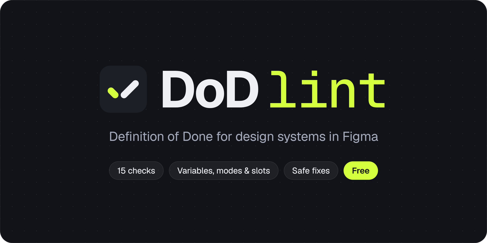
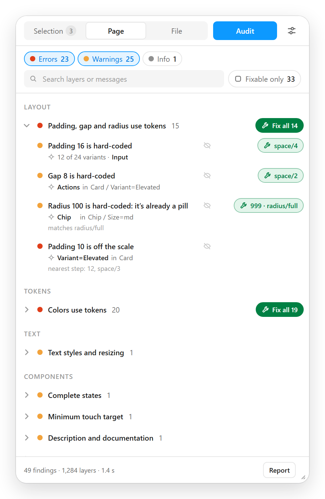
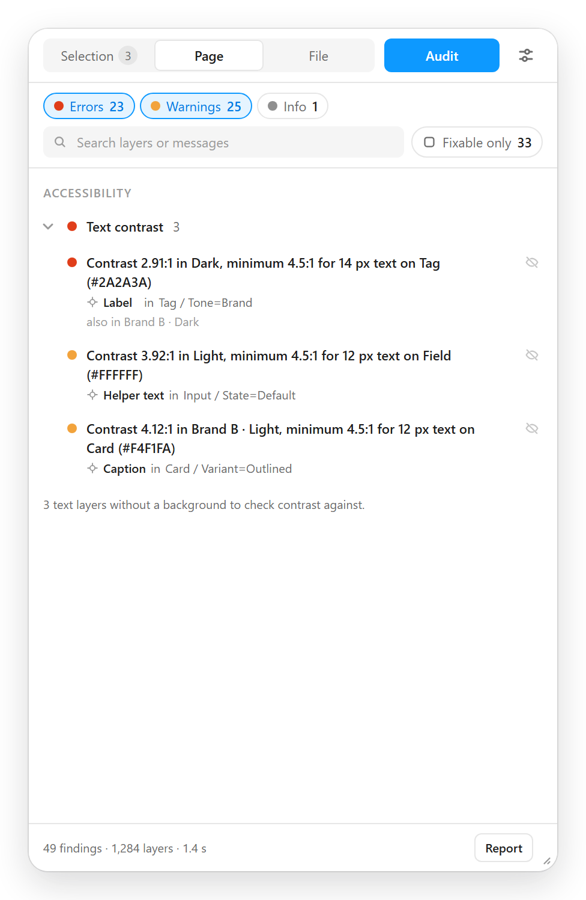
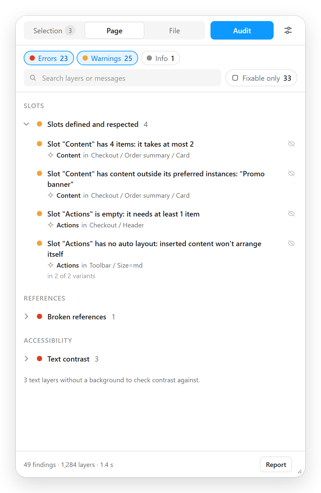
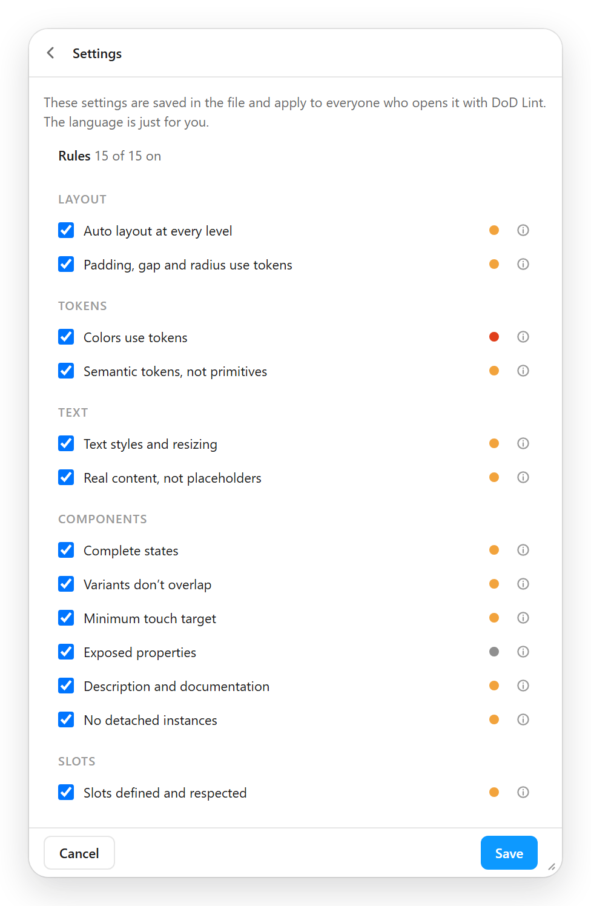

<p align="center">
  
</p>

<p align="center">
  
  
  
  
  
</p>

<p align="center">
  <a href="https://www.figma.com/community/plugin/1687960342520583098"></a>
</p>

<p align="center">
  <b>English</b> · <a href="README.es.md">Español</a>
</p>

DoD Lint is a Figma plugin that checks a page, a selection or a whole file against a design system **Definition of Done**: fifteen checks, from auto layout and tokens to states, touch targets, slots, detached instances, documentation and contrast. It lists each problem on the layer that has it, writes a Markdown report and fixes the cases where the right variable already exists.

It's free, all of it: selection, page and whole-file audits, fixes and the report. The interface and the findings are in English and Spanish. It follows your system language, and you can set it in the settings.

<p align="center">
  <a href="#the-15-checks">Checks</a> ·
  <a href="#safe-fixes">Fixes</a> ·
  <a href="#getting-started">Getting started</a> ·
  <a href="#privacy">Privacy</a> ·
  <a href="#help">Help</a> ·
  <a href="#development">Development</a>
</p>

## What it looks like

<table>
  <tr>
    <td align="center" valign="top" width="50%">
      <br>
      <sub><b>Findings and fixes.</b> Each finding on its layer. The wrench says which variable it binds.</sub>
    </td>
    <td align="center" valign="top" width="50%">
      <br>
      <sub><b>Contrast in every mode.</b> Inside a component, in every mode its colors depend on.</sub>
    </td>
  </tr>
  <tr>
    <td align="center" valign="top">
      <br>
      <sub><b>Slots.</b> Limits, content outside the preferred instances and empty slots.</sub>
    </td>
    <td align="center" valign="top">
      <br>
      <sub><b>Your Definition of Done.</b> The checks and their thresholds are saved in the file.</sub>
    </td>
  </tr>
</table>

<sub>Panel screenshots with the sample data in <code>docs/listing/source/mock.js</code>.</sub>

## The 15 checks

| | Check | What it flags | Severity | Fixes |
|---|---|---|:---:|:---:|
| **Layout** | Auto layout at every level<br>`auto-layout` | Frames and groups with two or more children and no auto layout. Top-level artboards, icons and vector art are skipped | 🟠 | |
| | Padding, gap and radius use tokens<br>`spacing` | Values typed by hand, and values off your spacing and radius scale. A radius that already makes a pill is bound to the scale's largest step, so it stays a pill at any size. If no spacing (or radius) variables are in use at all, a note says how many values were typed by hand instead of flagging every layer | 🔴 🟠 | ✓ |
| **Tokens** | Colors use tokens<br>`color` | Solid fills and strokes with a literal color and no variable or style. The frame of a variant set, which no instance inherits, isn't checked | 🔴 | ✓ |
| | Semantic tokens, not primitives<br>`primitive` | Fills and strokes bound straight to a variable from a primitive collection. Palette swatches named after the primitive they show are skipped | 🟠 | ✓ |
| **Text** | Text styles and resizing<br>`text` | Text without a text style or typography variables; fixed-size text boxes without truncation | 🟠 ⚪ | |
| | Real content, not placeholders<br>`placeholder` | Generic default text in components ("Text", "Label", "Button"…) and lorem ipsum anywhere. If it's the default value of a text property, which each instance changes, it's listed as info | 🟠 ⚪ | |
| **Components** | Complete states<br>`states` | Sets whose State axis is missing states, and interactive components without one. Buttons need Default, Hover, Pressed, Focus and Disabled; fields and selection controls, the same without Pressed | 🟠 ⚪ | |
| | Variants don't overlap<br>`stacked` | Variants in a set that overlap on the canvas. If one covers half or more of another, they're stacked and the one below goes unnoticed | 🟠 ⚪ | |
| | Minimum touch target<br>`touch` | Interactive components whose shorter side is below the minimum: 24 px by default, the WCAG 2.2 AA one | 🟠 | |
| | Exposed properties<br>`props` | Components with text but no text property, or a swappable icon with no instance swap or boolean | ⚪ | |
| | Description and documentation<br>`description` | Components without a useful description and, if you turn it on in settings, without a documentation link. Icons don't count | 🟠 ⚪ | |
| | No detached instances<br>`detached` | Frames detached from their component, which no longer get its changes. If the component was deleted, it's listed as info: there's nothing to relink | 🟠 ⚪ | |
| **Slots** | Slots defined and respected<br>`slots` | In components: slot properties with no layer, slots without auto layout, default content that breaks the slot's limits, "Only allow preferred instances" with an empty list, and slots without a description. In instances: slots below their minimum, above their maximum or with content outside the preferred instances | 🔴 🟠 ⚪ | |
| **References** | Broken references<br>`broken` | Variables, styles and main components that no longer resolve, and modes set on layers or pages for collections that no longer exist | 🔴 🟠 | ✓ |
| **Accessibility** | Text contrast<br>`contrast` | WCAG contrast against the effective background, in each text's own mode and, inside components, in every mode its colors depend on (light and dark, roles, brands). A mode set on a frame or the page is respected | 🔴 🟠 | |

<sub>🔴 error · 🟠 warning · ⚪ info · ✓ has a safe fix. Names and states are recognized in English, Spanish, French, German, Portuguese and Italian. The <a href="docs/support.md">help page</a> explains each check in full.</sub>

## Safe fixes

- **They never invent values.** They bind a variable that already exists and has exactly the same value, snap to the nearest step of your scale if you turn that on in settings (it's off by default, because it changes the measurement), or remove a reference that no longer resolves.
- **They check before touching anything.** Before each fix, DoD Lint checks that the layer and the variable are still as they were during the audit. If something changed, that fix is skipped.
- **By check or by row.** **Fix all** on a check applies the fixes the filter shows. The wrench on a row, which names the variable it binds ("space/sm", "12 · space/3"), fixes just that row.
- **One undo step per batch.** A notice at the bottom offers **Undo** for a few seconds. While DoD Lint has the focus, Ctrl+Z (Cmd+Z on Mac) undoes the batch too.

## Getting started

1. Get DoD Lint from [Figma Community](https://www.figma.com/community/plugin/1687960342520583098), open a design file and run **Plugins → DoD Lint**.
2. Choose what to audit: **Selection**, **Page** or **File** (every page).
3. Click **Audit**. The checks that run are in **Settings** (the sliders icon), and they're saved in the file, so everyone who opens it with DoD Lint audits against the same Definition of Done.
4. Click a finding to select its layer on the canvas.
5. Fix it with **Fix all** or the wrench on its row, or ignore it with the crossed-out eye.
6. **Report** gives you the audit in Markdown, to copy or download.

## Privacy

DoD Lint doesn't collect, store or send personal data or file content. It has no network access (declared in its manifest), no analytics and no third-party services. It reads the variables of the libraries enabled in the file, through Figma, to suggest them as fixes.

It only stores your language, in Figma's local plugin storage on your computer, and the settings and the findings you ignore, in the file's own plugin data. Read the [full privacy policy](docs/support.md#privacy-policy).

## Help

The [help page](docs/support.md) explains each check, the settings and the most common questions. For a bug or a question, [open an issue](https://github.com/jm-fuster/dod-lint/issues): say what you expected, what happened and which check was involved. Please don't attach confidential files.

## Development

```bash
npm install
npm run build    # dist/code.js, dist/ui.html, dist/standalone.js
npm test         # the tests in test/, against a simulated Figma
```

To load it in Figma Desktop: **Plugins → Development → Import plugin from manifest…** and pick `manifest.json`.

How it's built, the decisions behind each check, the tests and the performance measurements are in the [development notes](docs/desarrollo.md), in Spanish.

## License

DoD Lint has no open-source license: all rights are reserved. The code is public so you can read it, learn from it and report issues, but you may not reuse it in other projects or publish it as your own plugin.

<p align="center"><br></p>
