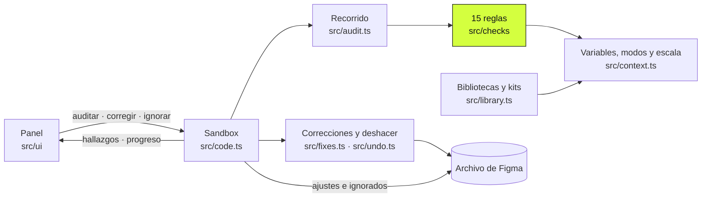
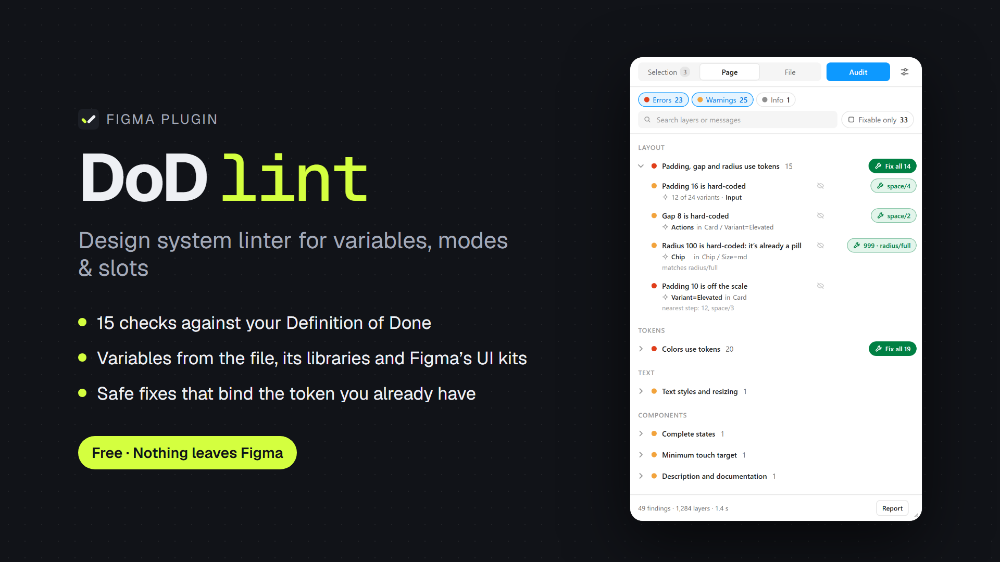
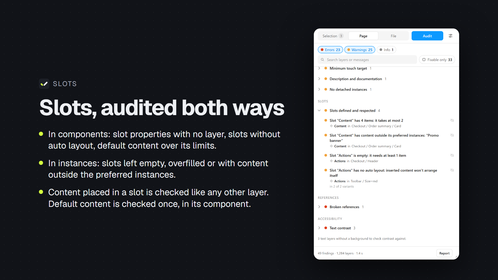
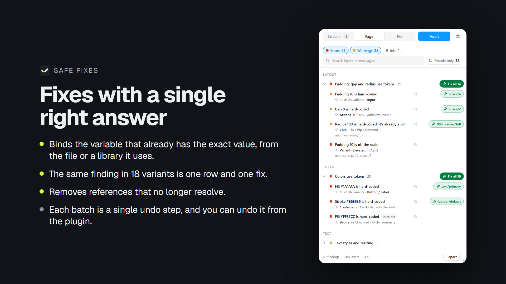
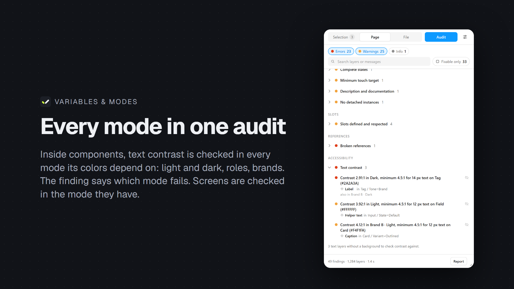
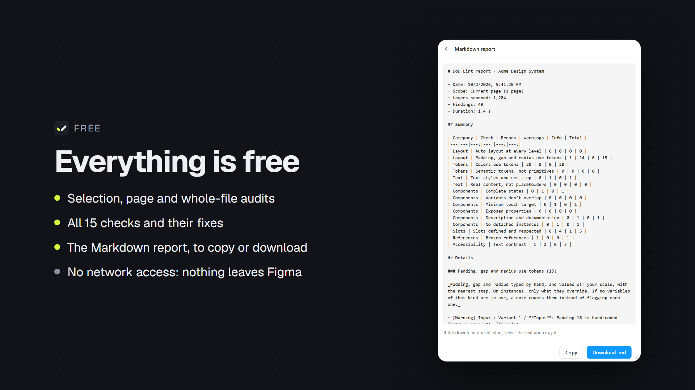

# DoD Lint · notas de desarrollo

Cómo está hecho el plugin, por qué y cuánto tarda. Lo que ve quien lo usa está en el [README](../README.es.md) y en la [ayuda](support.md), en inglés.

## Las reglas, en detalle

En el panel, cada regla tiene una descripción corta. Lo que no cabe en ella, y sirve para entender un hallazgo:

- **Espaciado y radio.** Los lados de un padding con el mismo valor y sin variable salen en un solo aviso, y su corrección los enlaza todos; si uno ha cambiado desde la auditoría, no se toca ninguno. Un radio que ya hace una píldora (la mitad del lado corto o más) se enlaza al paso mayor de la escala, que la sigue haciendo a cualquier tamaño. Ajustar a la escala nunca propone un paso que cambie la forma: ni que deje de ser una píldora ni que lo convierta en una.
- **Color.** Si varias variables semánticas valen lo mismo, gana la que tiene ámbito explícito para ese uso. Una con todos los ámbitos solo gana si ninguna otra coincidencia tiene ámbito propio; sin ningún ámbito no se propone nunca.
- **Primitivas.** Si la primitiva llega a través de una capa intermedia que la semántica elige según el modo (brand/light y brand/dark), se propone la semántica que la elige. Una muestra de paleta se reconoce porque ella o uno de sus tres ancestros acaba con el nombre de la variable.
- **Estados.** Se reconocen con sus sinónimos (Enabled = Default, Active = Pressed) y en femenino (Inactiva, Pulsada, Deshabilitada). Manda el eje llamado State, Estado, État, Zustand o Stato que tenga algún estado de interacción; si no lo hay, cualquier eje con dos o más (Hover, Pressed, Focus, Disabled), se llame como se llame. Un eje Status sin ningún estado de interacción (Success, Error…) no cuenta como eje de estado, salvo en un componente con nombre de control. Los iconos no cuentan aunque su nombre suene a control.
- **Objetivo táctil.** Los tamaños pequeños son las variantes Size=xs, xxs, sm, s, small, compact, dense, mini o tiny, también en los otros idiomas (Tamaño=Pequeño, Taille=Petit, Größe=Klein). Cada set se avisa una sola vez, y los iconos no cuentan.
- **Nombres.** Controles, estados, deshabilitado, tamaños pequeños, iconos, textos de relleno y variables de espaciado y de radio se reconocen en inglés, español, francés, alemán, portugués e italiano, sin distinguir mayúsculas ni acentos. El texto de una variante deshabilitada, en cualquier eje (Type=Disabled, Zustand=Deaktiviert), solo informa del contraste. En otro idioma, el eje de estado se reconoce por sus valores si tiene dos estados de interacción conocidos, y los nombres de control se añaden al patrón de ajustes, en cualquier alfabeto (ボタン, кнопка). «TODO» es relleno solo en mayúsculas: «Todo» es contenido en español.
- **Auto layout.** Los slots tienen su propia regla, tengan los hijos que tengan.
- **Bibliotecas.** Las variables de color y numéricas de las bibliotecas activadas en el archivo cuentan como las propias: con ellas se proponen correcciones, se saca la escala y se reconocen las primitivas que una biblioteca publica. Un archivo de producto casi no tiene variables propias, y sin ellas el plugin no proponía nada. Hay que importarlas: se importan al abrir el plugin, en segundo plano, y se guardan para la sesión; si se audita antes de que acabe, la auditoría la espera. Con FlySplit publicada como biblioteca (122 variables), la primera auditoría sin nada importado tardó 4,5 s la primera vez en el archivo y 1,6 s la siguiente, y con lo importado, 0,24 s. Importar no cambia el archivo. Si Figma le devolviera al archivo que publica una biblioteca sus propias colecciones (no está documentado ni medido), no se importan: una variable repetida empataría consigo misma y no se propondría. Una colección de biblioteca nunca cuenta como oculta: en el archivo que la usa Figma la da por oculta (visto el 02-10-2026 con FlySplit), pero está publicada, y si no, una biblioteca de colores sin alias, como Material 3, pasaría por primitiva. Para las primitivas de una biblioteca cuentan su nombre y que no tengan alias. Con Figma tapado, la importación espera a que vuelva, como los `setTimeout` (ver [Limitaciones conocidas](#limitaciones-conocidas)). Necesita el permiso `teamlibrary`.
- **Kits de Figma.** Los kits que Figma da a todo el mundo (Material 3, Simple Design System…) no salen entre las bibliotecas activadas, pero sus colecciones se listan e importan igual por su clave. Se descubren por las colecciones que dicen usar las capas de primer nivel (`resolvedVariableModes`): en las 30 páginas de FlySplit, 126 capas en 0,4 s. Sus variables quedan de reserva, por tipo: colores, espaciado y radio solo cuentan si el archivo y sus bibliotecas no tienen ninguna de ese tipo, y si no hacen falta no se importan. Así, un componente suelto de Material 3 en un boceto de FlySplit no cambia nada; antes de esta regla, sus blancos empataban con los de FlySplit y se proponían colores de Material 3 en sus pantallas. La primera vez en un archivo, las 196 de «M3» tardan 9,9 s (1,9 s otro día), y mientras tanto el panel dice cuántas lleva. Figma solo atiende las llamadas a bibliotecas en la pestaña que está delante: en una de fondo, la importación espera.

## Correcciones y deshacer

Lo básico (qué corrige y qué no) está en el [README](../README.es.md#correcciones-seguras). Esto es cómo funciona el deshacer.

Al corregir, un aviso abajo del panel ofrece «Deshacer» durante unos segundos, y no se va mientras tengas el ratón encima. Quita la tanda entera con el deshacer de Figma (`triggerUndo`), que deshace el último paso del historial. Por eso solo se ofrece mientras la tanda sea ese paso, y cualquier otro cambio tuyo en el archivo lo retira. Los cambios de otras personas no entran en tu historial y no cuentan. Antes de deshacer, el sandbox comprueba que las correcciones siguen puestas; después, que se han quitado. Si Figma ha deshecho otra cosa, el plugin lo dice y cómo rehacerla. Lo ignorado también se deshace desde ese aviso.

Con el foco en el plugin, Figma no recibe sus atajos. Ctrl+Z (Cmd+Z en Mac) hace lo que ofrezca ese aviso y, si no ofrece nada, se lo pasa a Figma con `triggerUndo`, como si se pulsara en el lienzo. En la búsqueda y en los campos de ajustes deshace lo escrito.

> [!NOTE]
> Rehacer no se puede desde el plugin: la API no tiene `triggerRedo`.

## Cómo funciona



| Archivo | Qué hace |
|---|---|
| `manifest.json` | Manifiesto (dynamic-page, sin red, permiso de bibliotecas; sin el permiso de pagos) |
| `src/code.ts` | Sandbox: mensajes de la UI, auditoría, correcciones, pagos |
| `src/audit.ts` | Recorrido iterativo del alcance (con los slots de las instancias) y ejecución de comprobaciones |
| `src/context.ts` | Variables, colecciones primitivas, escala, resolución de modos, slots, cachés |
| `src/library.ts` | Variables de las bibliotecas activadas y de los kits que usa el archivo, importadas una vez por sesión |
| `src/checks/*.ts` | Las quince comprobaciones (una función por regla) |
| `src/fixes.ts` | Correcciones seguras |
| `src/undo.ts` | Deshacer la última tanda de correcciones desde el plugin |
| `src/nodes.ts` | Búsqueda de capas por id, también dentro de instancias |
| `src/i18n.ts` | Idiomas: tipo `Text { en, es }` y resolución del idioma efectivo |
| `src/payments.ts` | Payments API y muro de pago, inactivos mientras el manifiesto no pida el permiso |
| `src/settings.ts` | Ajustes por defecto, fusión, y dónde se guarda cada uno (archivo o usuario) |
| `src/ignore.ts` | Hallazgos ignorados, guardados en el archivo |
| `src/ui/` | Interfaz (HTML + CSS + TS, sin framework) |
| `src/standalone.ts` | Bundle sin UI para probar las reglas desde una consola |
| `scripts/build.mjs` | Build con esbuild |
| `scripts/support-page.mjs` | La página de soporte con la marca (`docs/site/index.html`), a partir de `docs/support.md` |
| `.github/workflows/pages.yml` | Publica la página de soporte en GitHub Pages, solo con el repositorio público |
| `scripts/test.mjs` | Empaqueta las pruebas y las pasa por el runner de Node |
| `test/` | Pruebas con un Figma simulado (`test/figma.ts`) |
| `docs/` | Ficha de Community, página de soporte, marca (`docs/brand.md`), estas notas e imágenes de los README |

Cada texto visible lleva sus dos versiones juntas, en el sitio donde se usa: `ctx.tx({ es: '…', en: '…' })` en las reglas y `tx({ … })` en la UI. El tipo `Text` obliga a escribir las dos, así que un mensaje nuevo sin traducir no compila. Los mensajes de los hallazgos los escribe el sandbox al auditar, en el idioma que le pasa la UI.

## En el panel

### Ajustes

Los ajustes son la Definición de hecho del archivo. Se guardan en él (`pluginData` de la raíz, clave `dodlint.settings.v1`), y quien lo abra con DoD Lint audita con los mismos. Solo el idioma se guarda para cada persona (`clientStorage`).

- **Reglas activas.** Las que se pasan al auditar.
- **Colecciones primitivas.** Con la detección automática se consideran primitivas las colecciones ocultas de publicación o con nombre de primitiva que no contienen alias; si todas lo parecen, ninguna lo es. Con la detección desactivada, la lista marcada es literal.
- **Tamaño mínimo de un control, estados de botones y de campos, patrón de nombres interactivos, longitud mínima de descripción, pedir enlace de documentación (desactivado por defecto), prefijos ignorados.**
- **Recorrido.** Incluir capas ocultas, entrar en instancias, exigir auto layout a frames de primer nivel, espaciado y radio solo dentro de componentes, ajustar a la escala al corregir (los dos últimos, desactivados por defecto). «Solo dentro de componentes» es para archivos de biblioteca: en FlySplit, unos 1.950 de sus 1.960 avisos de espaciado y radio estaban en la documentación, los bocetos y Playground. Un archivo de producto lo deja desactivado, porque sus pantallas son lo que hay que revisar. Otra forma de apartar la documentación es ponerle a sus marcos un prefijo ignorado: en FlySplit, «Doc» deja el caso de estudio de 543 avisos en 9.

En el archivo solo se guarda lo que difiere de los valores por defecto, así que lo que nadie ha cambiado sigue a la versión del plugin. Cada auditoría vuelve a leer los ajustes del archivo antes de empezar, por si otra persona los ha cambiado con el plugin abierto. Al guardar se escribe solo lo que has cambiado tú, encima de lo que haya en ese momento. Cambiar solo el idioma no escribe en el archivo. Si no se puede escribir en él, el plugin lo dice y sigue con los ajustes que había.

### La lista

Los hallazgos se agrupan por categoría y regla. Cada fila dice arriba lo que pasa («Padding 10 fuera de escala») y debajo la capa y dónde está. Lo que explica por qué no hay corrección («3 variables coinciden») va en una línea aparte. «override», «en N instancias» y «en su instancia» son etiquetas, con la explicación al pasar el ratón. El mensaje entero sigue en el informe y en la búsqueda.

Errores, avisos e información se encienden y se apagan por separado, y la información empieza apagada: en la página Buttons de Material 3 eran 2.013 de 3.185 hallazgos, y tapaban los 144 errores y los 1.028 avisos. Si solo queda información, la lista dice que se cumple la Definición de hecho y cuántos hallazgos de información hay.

Si la capa y dónde está no caben, se recortan por partes: primero la carpeta del set o el principio de la ruta (por el principio, «…ented button»), después el nombre del set y lo último la capa. El sitio entero sale al pasar el ratón.

Una fila une dos cosas: los iguales de una misma capa (×N) y el mismo hallazgo de la misma capa en varias variantes de un set ("18 de 36 variantes · Button / Label"). Pulsar la fila selecciona todas sus capas en el lienzo, su botón de corregir las corrige todas y el ojo las ignora todas. Por debajo siguen siendo hallazgos sueltos: los recuentos, el informe y «Actualizar la lista» los cuentan uno a uno.

Las reglas activas se eligen en ajustes, arriba del todo. Antes de la primera auditoría, un enlace en la vista vacía lleva a ellas.

### Ignorar un hallazgo

El ojo tachado de cada fila, a la izquierda de su botón de corregir, ignora esa regla en esa capa. El hallazgo deja de contar, no se corrige y sale aparte en el informe. En un texto de instancia, que se lista una vez aunque se repita, ignora ese texto del componente en todas sus instancias. El filtro "Ignorados" los enseña, y el ojo los recupera. Justo después, el aviso de abajo también lo deshace.

Se guardan en el propio archivo (`pluginData` de la raíz, clave `dodlint.ignored.v1`), así que los ve igual quien lo abra con DoD Lint. Con los ajustes, es lo único que el plugin escribe en el archivo sin pulsar Corregir.

### Actualizar la lista

Si la página o un estilo cambian después de auditar, también por otra persona, sale una franja encima de los resultados con «Actualizar la lista». Vuelve a pasar las reglas solo por las capas que tienen hallazgos, sin bajar a sus hijos, y sustituye sus hallazgos en la lista sin reordenarla. También revisa las que se corrigieron desde la auditoría, por si alguna corrección se deshizo. Lo que cambia el propio plugin (corregir, ignorar, guardar ajustes) no cuenta como cambio. Un texto de instancia se revisa solo por contraste, y con las demás instancias que daban su mismo resultado. Una capa que una instancia sobrescribe se revisa solo por lo sobrescrito, y si ya no lo está, sus hallazgos desaparecen. Un hallazgo de página se revisa con su regla de página. Lo que aparezca en capas que no tenían hallazgos solo sale al volver a auditar.

## Desarrollo

```bash
npm install
npm run build        # dist/code.js, dist/ui.html, dist/standalone.js
npm run typecheck    # tsc --noEmit, del plugin y de las pruebas
npm test             # las pruebas de test/, sin Figma
npm run watch        # recompila el sandbox al guardar
npm run support-page # docs/site/index.html a partir de docs/support.md
```

Cargar en Figma Desktop: **Plugins → Development → Import plugin from manifest…** y elegir `manifest.json`. Cada `npm run build` se refleja al volver a ejecutar el plugin.

Mientras el manifiesto no pida el permiso `payments`, no hay muro de pago: todo está desbloqueado y la interfaz no enseña Pro ni candados. Para probarlo se añade `"permissions": ["payments"]` al manifiesto: en desarrollo sale entonces un botón **Simular pagado / no pagado**, que desaparece al compilar con `node scripts/build.mjs --prod`.

### Probar las reglas sin la interfaz

`dist/standalone.js` define `__dodlint.run(scope, overrides, maxPerCheck, pageName)` y `__dodlint.runNodes(ids, overrides, maxPerCheck)`, y se puede pegar en cualquier consola con acceso al objeto `figma` (por ejemplo, en `figma_execute` de figma-console). `runNodes` audita capas concretas por id sin tocar la selección, también capas dentro de una instancia. Los dos devuelven recuentos por comprobación y una muestra de hallazgos sin tocar el archivo.

### Pruebas

`npm test` empaqueta cada `test/*.test.ts` con esbuild (`scripts/test.mjs`) y las pasa por el runner de Node, sin Figma. `npm test -- fixes` pasa solo los archivos cuyo nombre contiene "fixes".

`test/figma.ts` simula lo justo de la API: variables que resuelven por modo siguiendo los alias, estilos, capas con `findAll`, `findAllWithCriteria` y `findOne` que se encuentran por id, una página de pruebas con otra de biblioteca para los componentes principales, y bibliotecas activadas (`addLibrary`) que se leen con `figma.teamLibrary` y se importan por su clave. También trae los constructores (`node`, `collection`, `color`, `float`, `solid`, `place`) y los atajos `context()` y `audit()`.

| Archivo | Qué cubre |
|---|---|
| `basics` | Color, contraste WCAG, ajustes, idioma y cómo se separa el contenido propio y heredado de un slot |
| `states` | La regla de estados y sus ejes (State, Estado, Status) |
| `names` | Lo que se reconoce por el nombre en los seis idiomas y sin acentos, y el eje de estado por sus valores |
| `tokens` | Color con ámbitos, primitivas en sistemas encadenados, espaciado y escala con alias, lo escrito a mano cuando no se usan variables de espaciado o de radio, y el espaciado solo dentro de componentes |
| `library` | Las variables de una biblioteca activada en correcciones, escala y primitivas publicadas, que se importen una vez por sesión, que lo que ya es del archivo no cuente dos veces, que una colección de biblioteca no cuente como oculta, que sin el permiso no cuenten, los kits que usan las capas (de reserva y sin importar lo que no hace falta) y el aviso de cuántas lleva |
| `fixes` | Cada corrección, y que se omita si la capa o la variable cambiaron desde la auditoría |
| `undo` | «Deshacer» solo llama al deshacer de Figma si la tanda sigue puesta, y avisa si Figma ha deshecho otra cosa |
| `nodes` | Buscar muchas capas de dentro de una instancia con un solo recorrido de esa instancia |
| `refs` | Referencias rotas en instancias, según de dónde venga su componente, y las lecturas que se ahorra |
| `traversal` | Instancias y slots (contenido propio y heredado, capas sueltas tras deshacer) y capas ocultas |
| `overrides` | Lo que una instancia sobrescribe en sus capas, también dentro de las anidadas, junto al contraste, los slots, las capas ignoradas y «Actualizar la lista» |
| `components` | Objetivo táctil, variantes apiladas o solapadas, instancias desvinculadas, iconos, enlace de documentación y contenido de relleno en propiedades |
| `reads` | Que la auditoría lea una sola vez cada propiedad cara de una capa o de una variable, y que, recorriendo la página entera, busque los textos de las instancias una vez por página |
| `settings` | La Definición de hecho guardada en el archivo y el idioma por usuario, guardar sin pisar lo que otra persona cambió, y ajustes de otras versiones |
| `contrast` | El contraste en todos los modos, con dos ejes encadenados, los modos fijados y las variables que no se saben resolver a mano |
| `ignore`, `modes`, `recheck`, `rows` | Ignorar hallazgos, modos huérfanos, «Actualizar la lista» y la agrupación por variantes de la lista |
| `pause` | Ceder el hilo por tiempo, con la ida y vuelta a la UI, y Cancelar al volver |

Lo que depende de cómo responde Figma de verdad (ids de slots, `limitViolations`, la resolución de modos) se mide en Figma y luego se lleva al simulado.

### Comparar dos versiones en un archivo real

Sin escribir en él:

1. Compilar cada versión con `npx esbuild src/standalone.ts --bundle --format=iife --global-name=__dodlint --define:__DEV__=false --minify`.
2. Servir las dos con `docs/listing/source/serve.mjs`.
3. En `figma_execute` (con `fileKey`, para no cambiar el archivo activo), cargar cada una con `fetch` + `new Function` y pasar `run('page', { language: 'es' }, 1000, página)`.
4. Comparar los hallazgos por regla, capa, mensaje y corrección.

Si las dos no caben en los 30 s de una llamada, la primera guarda lo suyo en `globalThis` y la segunda lo lee.

`run` y `runNodes` devuelven también `timings`: los milisegundos de cada regla y de cada tramo del recorrido (`init`, `descend`, `compare`, `slots` y el resto en `walk`). El bundle no cede el hilo, porque con Figma tapado por otra ventana los `setTimeout` no se disparan: una llamada que no cabe en los 30 s del puente sigue en el sandbox, y las siguientes no responden hasta que acaba. Una página así se puede auditar por tandas con `runNodes`, pasando sus secciones de primer nivel.

### Rendimiento

| Medida | Antes | Ahora | Notas |
|---|---:|---:|---|
| Material 3 · Buttons, en el plugin | 39,6 s | 16,3 s | 02-10-2026, con los mismos 3.185 hallazgos |
| FlySplit · prototipo (2.868 capas) | 7,6 s | 6,4 s | Referencias rotas, de 1,4 a 0,8 s |
| FlySplit entero · contraste | 9,5 s | 7,1 s | Los mismos hallazgos |
| Simple Design System · contraste | 7,7 s | 6,0 s | Los mismos hallazgos |
| Material 3 · Lists · contraste (32 modos) | 6,2 s | 2,1 s | 869 textos, 27 situaciones |

<details>
<summary><b>De dónde sale cada cifra</b></summary>

<br>

Casi todo el tiempo se va en leer propiedades, porque cada lectura cruza al hilo de Figma: 255 µs los rellenos de una capa, 130 µs sus variables enlazadas o sus modos, 35-65 µs cada campo de una variable (medido en septiembre de 2026). Por eso la auditoría lee cada propiedad una vez (`ctx.prop`, `ctx.parentOf`, `infoOf`) y las reglas la comparten; `test/reads.test.ts` lo comprueba. También lee así lo que compara de una instancia con su componente, porque la capa del componente es la misma en todas sus instancias.

Medido en octubre de 2026 con Figma Desktop: unos 3 ms por capa recorrida. Material 3 Buttons (20.530 capas recorridas) tardaba 51 s y Sliders (5.156), 14 s. En Buttons, lo que más tardaba era la regla de referencias rotas (12 s): leía de cada instancia lo que hereda de su componente, unas ocho lecturas por instancia, aunque el componente ya se revisa donde está. Ahora solo lo hace si el componente es de una biblioteca o se ha eliminado. En el prototipo de FlySplit (2.868 capas), la regla pasa de 1,4 a 0,8 s y la auditoría de 7,6 a 6,4 s, sin cambiar ningún aviso. Después vienen entrar en las instancias (8 s en Buttons) y el contraste (7,5 s).

El contraste lee el contenido, el tamaño y el peso de un texto solo si hacen falta para decidir (casi todos los textos pasan de 4,5:1), y la caja del texto solo si alguna capa hermana con relleno lo puede tapar; de cada hermana mira primero si queda debajo del texto, antes de leer sus rellenos. En FlySplit entero, el contraste pasa de 9,5 a 7,1 s, y en Simple Design System de 7,7 a 6,0 s, con los mismos hallazgos. Una página sin slots ya no los busca instancia a instancia: se miran una vez por página.

En el plugin, con Figma delante, Buttons de Material 3 tardaba 39,6 s por la mañana del 02-10-2026 y 16,3 s por la tarde, tras los cambios de ese día (referencias rotas, contraste con muchos modos, textos de las instancias), con los mismos 3.185 hallazgos. El banco del puente da tiempos más altos, y sirve para comparar versiones, no para dar la cifra.

</details>

## Limitaciones conocidas

- **Contraste.** Se evalúa en el modo de cada texto y, dentro de un componente principal (también en los componentes anidados en él), en cada modo de las colecciones de las que dependen el color del texto y el de su fondo, siguiendo los alias en todos los modos: claro y oscuro, roles, marcas. Un componente tiene que verse bien en todos los modos; una pantalla o una página de documentación, en el suyo. Así una pantalla clara y su copia oscura no repiten avisos, y la documentación que solo se ve en claro no se revisa en oscuro. Con dos ejes encadenados, como rol y tema, se prueban las combinaciones, y con más de 16 se cambia un eje cada vez. Con cuatro modos o más por revisar, un texto que repite la situación de otro que ya pasó en todos (las mismas capas debajo, con las mismas pinturas, opacidades y modos) no se vuelve a medir: en Lists de Material 3, con 32 modos, 869 textos son 27 situaciones, y el contraste pasa de 6,2 a 2,1 s con los mismos hallazgos. Un texto que no pasa se mide entero, para que el aviso diga su fondo y sus modos. Un modo que fija la capa o un ancestro (la página incluida) se respeta. El modo de la capa lo resuelve Figma; los demás se resuelven a mano, y solo si, para esa variable y esa capa, la resolución a mano da lo mismo que Figma en el modo de la capa. Si no (una colección extendida, por ejemplo), esos modos no se revisan. El aviso dice el modo que peor sale y los demás que fallan. Los textos de las instancias se miran donde están colocadas, así que una pantalla en oscuro revisa también los componentes que contiene. Si el mismo texto de un componente da el mismo resultado en varias instancias, sale una vez con la cuenta.
- **Capas ocultas.** Se saltan, salvo las que puede mostrar una propiedad booleana del componente o una variable: esas se auditan igual, porque aparecen en cuanto se activan.
- **Rótulos del lienzo.** Un texto suelto en la página o en una sección, fuera de cualquier frame, es un rótulo del lienzo: color, primitivas, estilo de texto, contenido de relleno y contraste no lo miran. Sí se revisan sus referencias rotas.
- **Fondos.** Los fondos con imagen o degradado no se evalúan; se cuentan como "no evaluables".
- **Sin variables de espaciado o de radio.** Si el archivo no tiene variables de espaciado (o de radio) y ninguna capa auditada está enlazada a una, lo escrito a mano de ese tipo no se avisa capa a capa: no hay ningún token al que enlazarlo. Una nota en los resultados y en el informe dice cuántos valores son. Basta una capa enlazada, también a una variable de biblioteca o por lo que una instancia hereda de su componente, para que se avisen. «Actualizar la lista» decide como la auditoría.
- **Instancias.** De una instancia se revisa lo que sobrescribe, en ella o en cualquier capa de dentro (rellenos, trazos, padding, gap, radio, tipografía, el contenido de un texto, sus referencias y sus modos), su componente principal y el contraste de sus textos, salvo que se active "entrar en las instancias". Figma marca como sobrescrito el modo puesto en una instancia (los 16 que cambiaban el de su componente en FlySplit y Simple Design System, octubre de 2026); el que hereda se revisa en el componente. Si su componente es de una biblioteca o se ha eliminado, sus referencias rotas se revisan enteras, porque lo que hereda roto solo se ve en ella. Lo que sobrescribe dentro de una instancia anidada también cuenta. El resto de cada capa viene del componente y se revisa en él.
- **Contenido de los slots.** El contenido que se pone en los slots de una instancia se audita siempre, como cualquier otra capa. El contenido por defecto de un slot se revisa una vez, en el componente. Con "entrar en las instancias" ese contenido por defecto también se recorre dentro de cada instancia, sin ofrecer correcciones: en Figma, tocar una sola capa de un slot sobrescribe el slot entero y deja de recibir los cambios del componente.
- **Límites de los slots.** Los límites (mínimo, máximo, solo instancias preferidas) los calcula Figma (`limitViolations`). Un slot vacío con mínimo se avisa en cada instancia que no lo rellena; en el componente es el patrón de slot obligatorio y no se avisa.
- **Pagos.** Con el pago activado, si el servicio de pagos de Figma no responde (estado NOT_SUPPORTED), el plugin no concede las funciones Pro y ofrece reintentar, como pide la documentación de la Payments API.
- **Tope.** Cada comprobación se corta a 1.000 hallazgos por auditoría y lo indica.
- **Ceder el hilo.** La auditoría cede el hilo cada 100 ms de trabajo, para que Figma y el panel respondan, y lo hace con una ida y vuelta a la UI: con Figma tapado por otra ventana los `setTimeout` no se disparan, y una auditoría que cedía con ellos se quedaba parada hasta volver a Figma. Con la ida y vuelta sigue (probado en Material 3, Buttons, el 02-10-2026). Un paso suelto puede tardar más: en los sets más grandes de Material 3, hasta 0,46 s.

## Publicar

Decisión del 02-10-2026: se publica gratis, todo y desde el primer día. Los textos, las etiquetas, las imágenes y la lista de comprobación están en [`docs/community-listing.md`](community-listing.md), y la página de soporte, que es la URL de contacto obligatoria, en [`docs/support.md`](support.md).

1. Crear el plugin en Figma (**Plugins → Development → New plugin**) para obtener un `id` real y copiarlo a `manifest.json`.
2. Compilar con `node scripts/build.mjs --prod`.
3. Publicar como plugin gratuito desde el perfil personal, no desde un equipo: si el plugin vive en un equipo, los ajustes de precio se desactivan, y harían falta si algún día se añade una función de pago.

Reglas de revisión que este plugin respeta: no ofrece chat de IA ni servidor MCP, no accede a la red (`allowedDomains: ["none"]`) y hace exactamente lo que describe.

### Abrir el repositorio

El repositorio es privado hasta que se publique el plugin. Va sin licencia (decisión del 02-10-2026): todos los derechos reservados, como explican los README. Se puede pasar a MIT más adelante; al revés no, porque lo publicado con MIT se queda con MIT. Para abrirlo:

1. Pasarlo a público: `gh repo edit jm-fuster/dod-lint --visibility public --accept-visibility-change-consequences`.
2. Activar Pages con GitHub Actions como origen: `gh api -X POST repos/jm-fuster/dod-lint/pages -f build_type=workflow`. En el plan gratuito no se puede antes, con el repositorio privado.
3. Publicar la página de soporte: `gh workflow run pages.yml`. Queda en https://jm-fuster.github.io/dod-lint/, y desde entonces se vuelve a publicar sola con cada cambio de `docs/support.md`, `docs/site/` o `scripts/support-page.mjs` en `main`. Mientras el repositorio era privado, el flujo se saltaba sin hacer nada.
4. Ponerla como web del repositorio: `gh repo edit jm-fuster/dod-lint --homepage https://jm-fuster.github.io/dod-lint/`.
5. A mano, en GitHub: el banner (`docs/readme/en/banner.png`) como vista previa social, en Settings del repositorio, y «Keep my email addresses private» en la cuenta.

<details>
<summary><b>Si algún día se añade una función de pago</b></summary>

<br>

El manifiesto no pide el permiso `payments`. Sin él, leer `figma.payments` da error, así que `src/payments.ts` lo trata como «sin pago» (`FREE`) y todo queda desbloqueado. El código del pago se conserva, inactivo, por si algún día se añade una función nueva de pago:

- Figma deja añadir funciones de pago a un plugin publicado gratis, con la Payments API, siempre que conserve las gratuitas, pero no volverlo de pago entero. Lo que ya es gratis tiene que seguir siéndolo: solo se podría cobrar por algo nuevo.
- Para activarlo, volver a poner `"permissions": ["payments"]` en el manifiesto: la interfaz enseña Pro, los candados y, en desarrollo, el botón para simular el pago. Antes, comprobar en el perfil de Community que la cuenta individual puede vender y activar Stripe.
- Un plugin de pago no puede volver a ser gratis, y el modelo (pago único o suscripción) no se puede cambiar después de elegirlo; el precio, sí. Figma retiene el 15 %, y el saldo se puede retirar 30 días hábiles (EE. UU.) después de cada venta.
- Para probar el muro de pago una vez publicado hace falta otra cuenta: para el propio creador el estado siempre es PAID.

</details>

### Ficha de Community

<table>
  <tr>
    <td align="center"><br><sub>Miniatura</sub></td>
    <td align="center"><br><sub>Slots</sub></td>
  </tr>
  <tr>
    <td align="center"><br><sub>Correcciones</sub></td>
    <td align="center"><br><sub>Modos</sub></td>
  </tr>
  <tr>
    <td align="center"><br><sub>Gratis</sub></td>
    <td align="center"><br><sub>Icono, 128 px</sub></td>
  </tr>
</table>

## Documentación

| Archivo | Qué hay |
|---|---|
| [`docs/support.md`](support.md) | Ayuda y política de privacidad, en inglés: la fuente de la página de soporte |
| [`docs/site/index.html`](site/index.html) | La página de soporte con la marca, generada con `npm run support-page` |
| [`docs/community-listing.md`](community-listing.md) | Textos, etiquetas, imágenes y lista de comprobación de la ficha de Community |
| [`docs/brand.md`](brand.md) | La marca: colores con su contraste, tipografía y la palomita |
| [`docs/listing/source/`](listing/source/) | Cómo se rehacen las imágenes de la ficha y las de los README |
